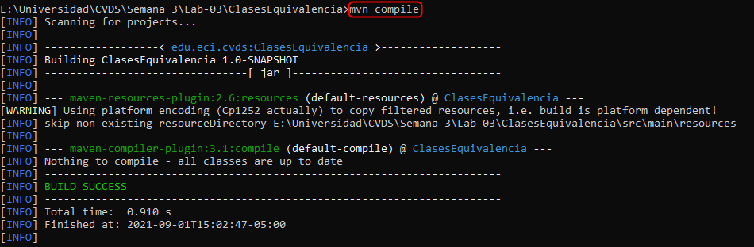
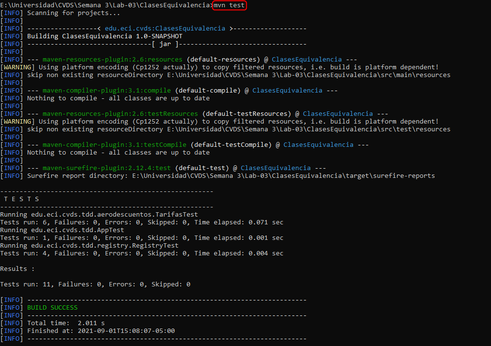

# CLASES DE EQUIVALENCIA

## COMPILAR Y EJECUTAR

+ Busque el comando requerido para ejecutar las pruebas unitarias de un proyecto desde Maven y ejecútelo sobre el proyecto. Se debe ejecutar la clase AppTest con resultado exitoso.

	+ **mvn test** : Este comando permite ejecutar los test alojados en el carpeta `/src/test/java`
	
## EJECUTAR LAS PRUEBAS

+ Revise cual es la diferencia entre `mvn test` y `mvn package`

	+ La diferencia es que con el comando mvn package la ejecucion de pruebas llega a ser opcional, en cambio con mvn test la ejecucion de dicahs pruebas es obligatoria.

# EJERCICIO "DESCUENTO DE TARIFAS"

# IMPLEMENTACIÓN DE LAS PRUEBAS

+ Ejecute el comando de Maven para las fases de compilación y pruebas. Verifique el resultado exitoso de todas las pruebas y el reporte generado.

	+ Para la fase de compilación vamos a usar el comando `mvn compile` que como su nombre lo indica solo realiza la compilacion de nuestro proyecto.
	+ El resultado de la ejecucion se muestra acontinuacion: 
	
	
	
	+ Para la fase de test ejecutaremos el comando `mvn test` para que como su nombre lo indica nos ejecutes los test de tengamos.
	+ El resultado de la ejecucion se muestra acontinuacion:
	
	
	
## Biliografia

<https://www.it-swarm-es.com/es/java/en-que-se-diferencian-mvn-clean-package-y-mvn-clean-install/1073878733/>